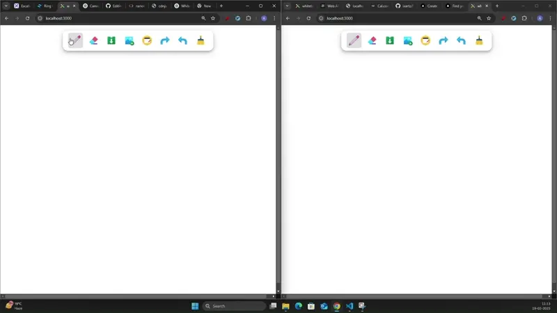

### [Whiteboard](https://old-whiteboard.abhiarya.in)

A simple and functional whiteboard application that allows users to collaborate and draw, erase, download, notes, and clear their work in an easy-to-use interface.

<div style="display:flex; flex-wrap:wrap; margin:3rem; justify-content:center;">
<p align="center">

</p>
</div>

##### Features

- Collaboration on whiteboard
- Basic freehand drawing
- Import images or videos
- Take notes
- Download

##### Technologies used

- WebSocket
- HTML5
- CSS3
- JavaScript

##### Setup and Installation

- Clone the repository:

```bash
git clone https://github.com/AbhiArya20/old-whiteboard.git
```

- Navigate to the project directory:

```bash
cd excel
```

- Install dependencies

```bash
npm install
```

- Run

```bash
npm start
```

- check out your localhost

```bash
http://localhost:3000
```
